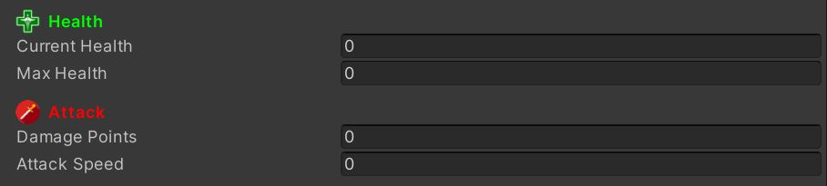

# HeaderPlus
Custom *Inspector* property header that allows using an icon, a custom header label text and a custom header label color.

## How to use
Put the attribute in front of a property.<BR/>
You can specify a icon path, a custom label text and a custom label color.<BR/>
You can use an empty string for the icon path for not using custom icon.<BR/>
You can use **HeaderPlusColor** *enum* color preset and cast it to int, or an array of float[0-1] (RGBA).

## Examples
```cs
[HeaderPlus("Assets/PathToYourIcon/health.png", "Health Points", (int)HeaderPlusColor.green))]
public int healthPoints;
[HeaderPlus("Assets/PathToYourIcon/sword.png", "Health Points", new float[] { 1f, 0f, 0f, 1f }))]
public int damages;
```

