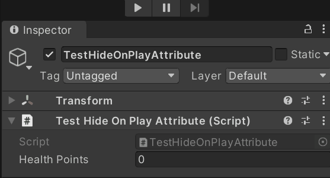

# HideOnPlay
Hides the property in *PlayMode*. The behaviour can be inverted with the 'invert' parameter so the property is visible only in *PlayMode*.

## How to use
Put the attribute in front of a property.<BR/>

## Examples
```cs
[HideOnPlay]
public int healthPoints;
[HideOnPlay(true)]
public int damages;
```

