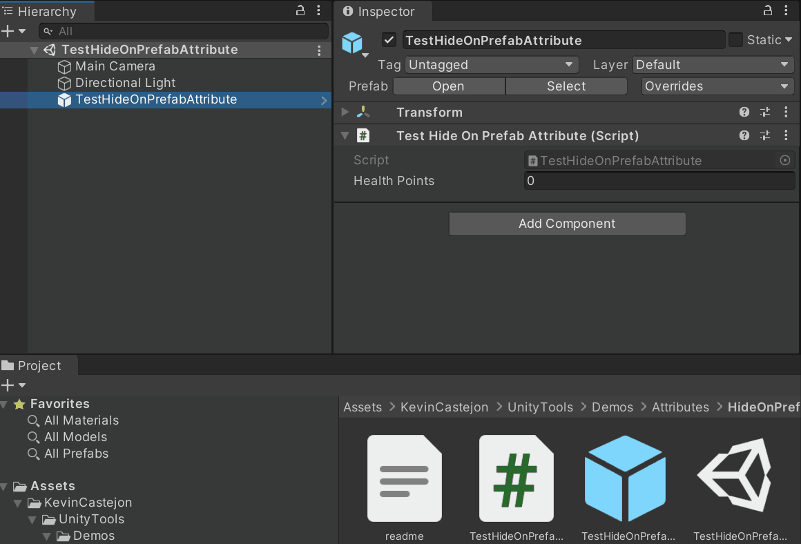

# HideOnPrefab
Hides the property in *PrefabMode*. The behaviour can be inverted with the 'invert' parameter so the property is visible only in *PrefabMode*.

## How to use
Put the attribute in front of a property.<BR/>

## Examples
```cs
[HideOnPrefab]
public int healthPoints;
[HideOnPrefab(true)]
public int damages;
```

