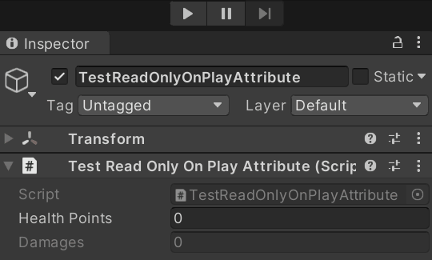

# ReadOnlyOnPlay
Prevents a property from being edited on the inspector in PlayMode. The behaviour can be inverted so the property is editable only in PlayMode.

## How to use
Put the attribute in front of a property.<BR/>

## Examples
```cs
[ReadOnlyOnPlay]
public int healthPoints;
[ReadOnlyOnPlay(true)]
public int damages;
```

