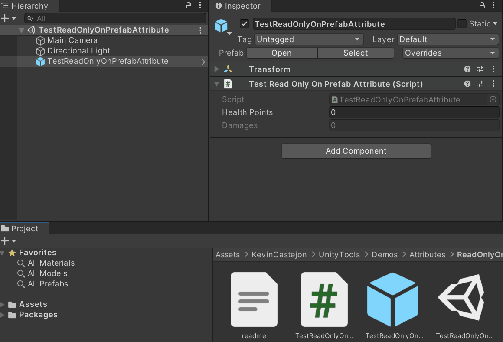

# ReadOnlyOnPrefab
Prevents a property from being edited on the inspector in PrefabMode. The behaviour can be inverted so the property is editable only in PrefabMode.

## How to use
Put the attribute in front of a property.<BR/>

## Examples
```cs
[ReadOnlyOnPrefab]
public int healthPoints;
[ReadOnlyOnPrefab(true)]
public int damages;
```

