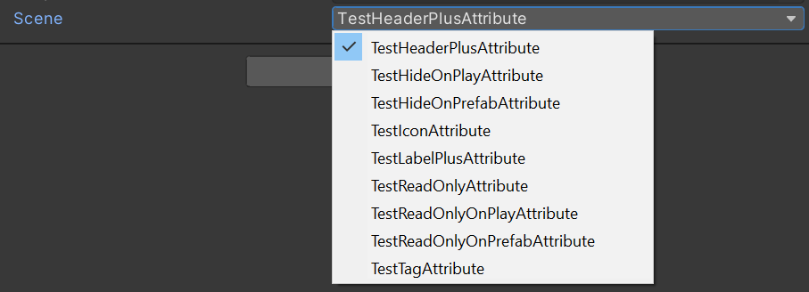

# Scene
Displays a dropdown list of available build settings Scenes (must be used with a 'string' typed property).

## How to use
Put the attribute in front of a property.

## Examples
```cs
[Scene]
public string _scene;
```

