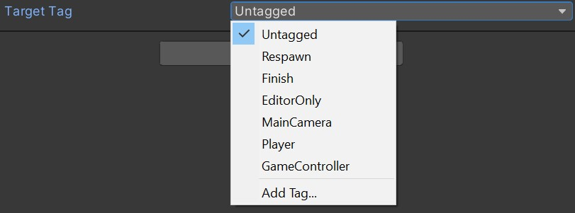

# Tag
Displays a dropdown list of available Tags (must be used with a 'string' typed property).

## How to use
Put the attribute in front of a property.

## Examples
```cs
[Tag]
public string _targetTag;
```

