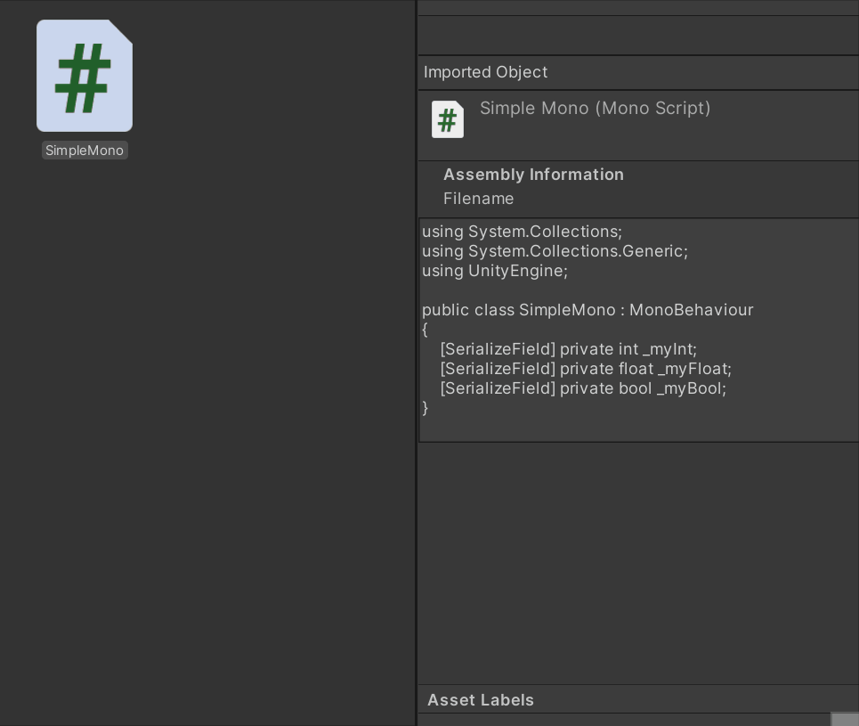

# CustomEditorGenerator

Generate a base **Editor** script for any **MonoBehaviour** or **ScriptableObject** script.

## How to use

- Right-click on **MonoBehaviour** or **ScriptableObject** script on the **ProjectView** and browse to ***EditorTools > Generate Custom Editor***.

