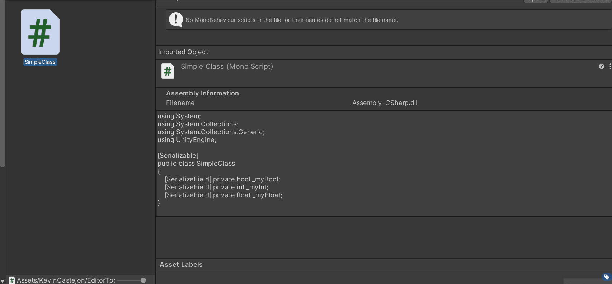

# CustomPropertyDrawerGenerator

Generate a base **CustomDrawer** script for any C# plain class script.

## How to use

- Right-click on C# plain class script on the **ProjectView** and browse to ***EditorTools > Generate Custom Property Drawer***.

