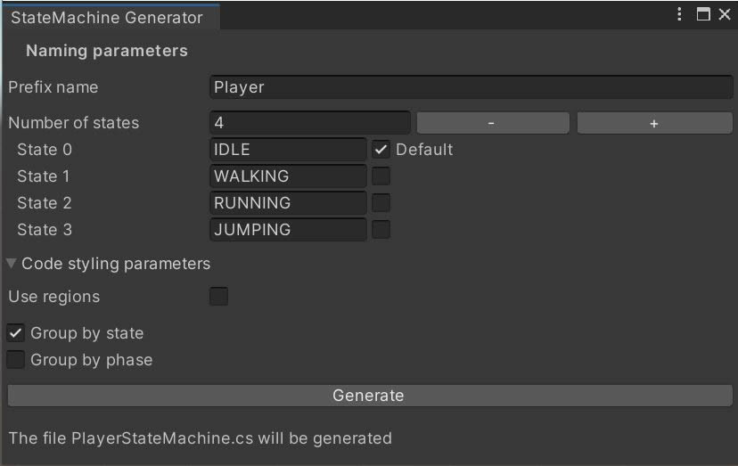

# StateMachineGenerator

Generate **StateMachine** scripts squeletons with a few clicks.

## How to use

- Open the **StateMachineGenerator** window by browsing the menu ***Window > StateMachineGenerator***.
- Add / remove / modify states names.
  - You can set some code-styling options like ***regions*** usage and methods grouping.
- Generate the script by clicking **Generate**.

