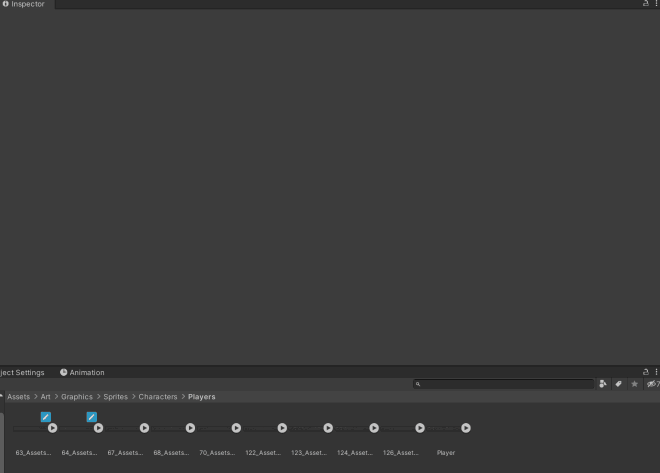

# TexturesMaxSizesSetter

Automatically set the Max Texture Size on multiple Texture2D assets according to their real sizes.

## How to use

- Right-click on Texture2D assets selection (you can select folders as well) and browse to ***EditorTools > Set Automatic Textures Sizes***.
- Confirm by clicking **Ok**.

