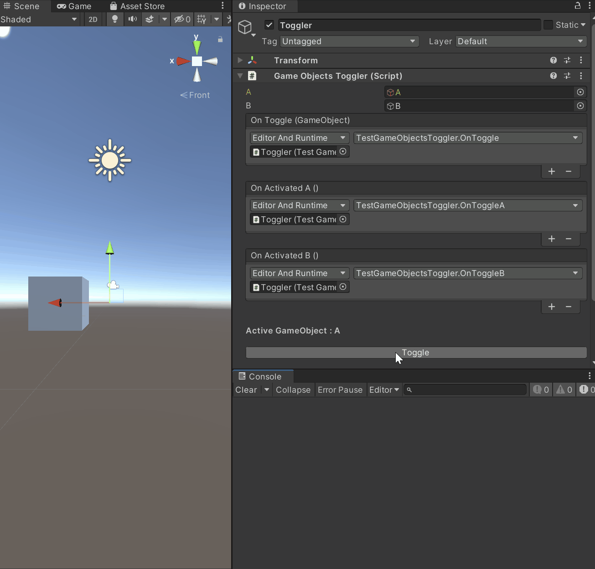

# GameObjectsToggler
Switch the enable state between two GameObjects and fire events on switching.

## How to use
Add the **GameObjectsToggler** component to a **GameObject**.
Bind methods to the provided **UnityEvents**.
Use the **ToggleButton** into the inspector, or use the **Toggle()** method via a script.

